# Pixels Agent Bridge

**Control your devices remotely with your AI agent.**

English · [简体中文](README.zh-CN.md)

Pixels Agent Bridge gives AI agents access to your computers through MCP. Use natural language to run commands, manage files, inspect the system, and operate desktop applications across devices.

## What it can do

- **Commands and terminals:** run programs, use interactive terminals, and read task output.
- **Files:** upload, download, search, edit, copy, and archive files, with background transfers and progress tracking.
- **Desktop automation:** capture JPEG screenshots, inspect windows and UI controls, and send mouse and keyboard input on Windows and macOS.
- **System and development tools:** inspect system resources, processes, and networks; work with supported service, Git, and Docker operations.
- **Desktop app:** manage devices, view local task history, and monitor each agent's MCP connections. Includes English, Simplified Chinese, Traditional Chinese, and light/dark themes.
- **Accounts and Web console:** register and sign in, view devices and online status, manage accounts, and configure user Relay bandwidth limits. Task history stays local and is not uploaded to the server.

Built-in setup supports **Codex, Kimi Code, Claude Code, DeepSeek Harness, and OpenCode**. Other clients can use the stdio MCP entry point.

## Supported platforms

| Platform | Available components |
|---|---|
| Windows | Desktop app, background device service, MCP |
| macOS | Desktop app, background device service, MCP |
| Linux | Headless device service and MCP; no desktop app |

Capabilities depend on the target OS and permissions. macOS screen capture and input require the corresponding system permissions. The project is in active development; see the [acceptance reports](acceptance/README.md) for tested scenarios and remaining limits.

## Quick start

1. **Install** the appropriate package on the operator and target computers, using the same control server. See [installation and packaging](packaging/desktop/README.md) or [headless Linux setup](packaging/desktop/unix/INSTALL-LINUX.txt).
2. **Save a connection.** In the target's Desktop app, find its nine-digit device code and password. Enter them in the operator's connection form and connect once. MCP then uses the saved credentials.
3. **Enable your agent.** Open **Settings → AI Agent**, enable your client, then restart it or start a new session. Live sessions appear under **MCP connections**.
4. **Give it a task:**

   > Use Pixels to connect to device 123456789, check its operating system and free disk space, and summarize the result.

The initiating Desktop or MCP must be signed in to add or control devices. Register or sign in through Desktop; the receiving device can run unattended without account login. Sign-in is retained until you sign out; already running MCPs pick up account changes automatically. Signing in does not replace the target device's password.

When GitHub sign-in is enabled, choose **Continue with GitHub** to sign in without a separate registration form or password. Your first authorization creates an ordinary account automatically. Existing users can link GitHub from their account page. Self-hosted instances configure their own [GitHub App](GITHUB_LOGIN_SETUP.md).

## How it works



[Open the animated workflow](diagram/workflow/agent-workflow.svg)

Your agent calls a local MCP process, which connects to the target device's Executor. The control server handles device discovery and authentication; operation data travels over P2P when available, with Relay fallback.

Each MCP maintains its own connections. Desktop shows their activity and local history. Multiple agents can use the same device, but operations on shared files or the same desktop still need coordination.

## Build and self-host

The desktop uses **Rust + Tauri + React + Ant Design**. The Web console uses **React + Ant Design**, with a Rust server, PostgreSQL, and Relay behind it.

To build a Windows Release installer after setting up the [build prerequisites](BUILDING.md):

```powershell
npm --prefix apps/desktop ci
python scripts/build.py desktop --profile release --package
```

Packages are written to `.build/packages/`. Installer versions increment automatically; internal component versions remain independent, and builds reuse cached artifacts.

For your own server, follow the [Web deployment guide](WEB_DEPLOYMENT.md) and [Docker Compose instructions](packaging/docker/README.md). Keep Server, Relay, and clients on compatible releases. Development schema resets require devices to register again.

## More documentation

- [Builds and versioning](BUILDING.md)
- [Installer publishing and online updates](docs/RELEASE.md)
- [Development guide](DEVELOPMENT.md)
- [macOS setup and permissions](MACOS.md)
- [Account implementation and verification](acceptance/user-accounts-2026-10-08.md)
- [AI agent integrations](acceptance/agent-integrations-2026-10-08.md)
- [Test coverage and platform limits](acceptance/README.md)

[Report an issue](https://github.com/PixelsCloud/PixelsAgentBridge/issues) with your platform, reproduction steps, and logs with credentials removed.
