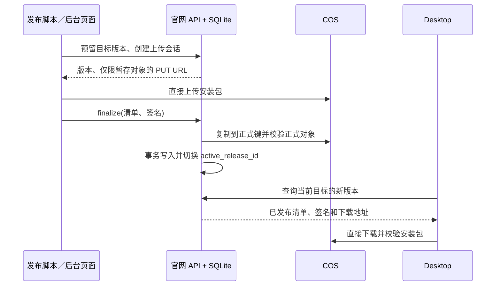

# 安装包自动发布与客户端升级设计

状态：待实现。本文是 Windows/macOS 安装包的实施方案；普通开发构建不自动发布。

## 目标与边界

- 一条命令完成版本分配、构建、校验、上传和发布；Windows 与 macOS 可以在不同机器上执行。
- 官网管理发布记录，安装包存放在腾讯云 COS；浏览器和客户端直接从 COS 下载，不让官网服务器转发安装包。
- 官网提供可选的手工发布、查看历史和回滚页面，调用与脚本相同的发布接口。
- Desktop 查询新版本、下载并校验完整安装包，经用户确认后运行现有安装器。第一次采用新升级功能的版本仍需通过当前下载页安装。
- 只递增对外安装包版本。Rust、npm、Tauri 组件版本维持各自现状；用户此前要求的文件名中的版本号继续保留。
- 首期覆盖已发布的 Windows x86_64 和 macOS aarch64；其他架构有可用安装包后再启用。Server/Relay 镜像升级不属于本流程。

## 当前代码与必要改动

| 现状 | 改动 |
| --- | --- |
| `PixelsAgentBridgeSite` 的 `/api/releases` 和 `/downloads/{id}` 从 COS `catalog.json` 读取 | 改为读取官网数据库；下载路由仍跳转到 COS 默认域名 |
| `PixelsAgentBridgeSite/scripts/publish_cos.py` 使用本机 COSCLI 发布包并覆盖目录 | 退为一次性迁移/应急工具；日常由统一发布脚本调用官网 API |
| 主仓库 `scripts/build.py` 从本地 `build-version.json` 分配版本 | 增加“使用外部分配版本”入口；普通本地构建行为保留，发布构建采用官网分配的版本 |
| Windows NSIS 和 macOS PKG 都有 SHA-256 清单 | 发布脚本校验清单，再生成带签名的升级清单 |
| Desktop 用 `__PAB_RELEASE_VERSION__` 显示安装包版本 | Rust 侧取得同一版本并负责更新检查、下载、校验、启动安装；前端只展示状态和用户操作 |
| 官网容器只读且没有持久化数据库 | 增加 SQLite 持久化卷、迁移和私有凭据配置；应用目录继续只读 |

官网项目路径为 `D:/GoCloud/PixelsAgentBridgeSite`，客户端/安装器项目路径为 `D:/GoCloud/PixelsAgentBridge`。官网和主项目是两个独立代码目录，跨目录契约由 API 和签名清单约束。

## 数据与版本规则

官网 SQLite 是**唯一发布状态来源**，COS 只存文件。使用 WAL 模式、数据库迁移和持久化卷；当前只有一台官网服务器，不引入额外数据库服务。部署脚本在迁移前备份数据库并验证备份可读。

最低限度的表：

| 表 | 关键字段与约束 |
| --- | --- |
| `release_targets` | `platform, architecture, channel` 唯一；`last_allocated_version`、`active_release_id` |
| `release_reservations` | `id, target, version, build_id, commit, created_at, state`；`target + version` 唯一；已分配的号不复用 |
| `upload_sessions` | `id, reservation_id, staging_key, expires_at, state, idempotency_key`；幂等键唯一 |
| `releases` | `id, target, version, filename, object_key, size, sha256, signature, notes_zh, notes_en, build_commit, published_at, state`；`target + version` 唯一 |
| `release_events` | 操作者/令牌标识、动作、目标、时间与结果，用于审计和故障定位 |

`target = platform + architecture + channel`，初始频道只有 `stable`。版本按现有 `major.minor.patch` 数值规则递增，每个目标独立分配：Windows 和 Mac 不需要同号；官网用数据库事务加唯一约束防止两台构建机抢到同一版本。保留本地 `build-version.json` 供开发构建使用，但发布构建不能再以本地文件判断“最新版”。同一目标只能激活比当前版本新的正常发布；回滚是管理员显式把 `active_release_id` 指向一条历史已验证记录，之后的新版本仍按 `last_allocated_version` 递增。

对象键采用 `staging/<upload-session-id>/package` 和 `releases/<platform>/<architecture>/<version>/<filename>`。前者为私有暂存文件，后者为不可覆盖的正式文件。为暂存前缀设置过期清理；历史正式文件至少保留到确认不再需要回滚。

## 一键发布流程

默认命令形态：

```text
python scripts/release.py windows --channel stable --notes-zh "..." --notes-en "..."
python scripts/release.py macos --arch aarch64 --channel stable --notes-zh "..." --notes-en "..."
```

脚本从私有环境变量或本机私有文件读取**发布 API 令牌**；构建机器不持有 COS SecretId/SecretKey。流程如下：

1. 检查工作目录、工具链和发布条件；默认要求 Git 工作区干净，并记录 commit。调用官网“预留版本”接口得到目标版本和 `reservation_id`。失败的构建保留已占用版本号，不发布空记录。
2. 以该版本调用现有 `scripts/build.py --profile release --package`，只构建所选平台，复用增量编译缓存；打包器继续输出带版本号的 `.exe`/`.pkg` 和 SHA-256 清单。需要给 `build.py` 增加发布专用版本覆盖参数，写入构建记录，并确保前端显示、安装包文件名、包元数据版本一致。
3. 执行必要的构建/安装器校验；根据本地文件重新计算长度和 SHA-256，并与打包清单逐项比较。生成包含目标、版本、文件名、长度、SHA-256 的规范化升级清单，并用离线发布私钥签名。若提供 Apple Developer ID Installer 身份与公证配置，脚本还会自动签名、公证并装订 PKG；当前开发环境没有该身份，因此先以发布清单签名保证升级完整性，Mac 安装可能显示系统的未签名提示。
4. 调用官网“创建上传会话”接口，发送清单、签名、更新说明和幂等键。官网只签发指定随机暂存对象的短期 COS `PUT` URL。脚本直接传到 COS；连接中断时查询会话状态，必要时重新获取同一暂存对象的上传 URL。
5. 调用 `finalize`。官网把暂存对象复制到仅由官网可写的正式对象键，对**复制后的正式对象**流式计算 SHA-256，核对大小、清单签名和预留版本，然后设置下载权限。在数据库事务中写入发布记录并切换该目标的 `active_release_id`。再次调用同一个 `finalize` 返回同一结果。
6. 脚本调用公开更新接口和下载路由验收版本、长度与可访问性，输出发布链接和结果。任何一步失败都以非零码退出，保留可查询的预留/上传状态供重试；不会切换到未验收的包。



网页后台的“手工发布”也先预留版本、上传并 finalize；选择本地包后在浏览器直传 COS，须为官网来源配置 COS CORS。手工发布同样必须提供有效的离线签名清单，不能绕开校验。页面还提供历史、失败会话和回滚入口。日常发布以脚本为准，网页用于补发或排障。

## 官网接口契约

所有写接口使用 HTTPS，仅管理员会话或作用域为 `release:publish` 的令牌可调用；令牌不进入 URL。示意接口如下，具体字段在实现时形成 OpenAPI/共享测试样例：

| 方法与路径 | 作用 |
| --- | --- |
| `POST /api/admin/release-reservations` | 按目标原子分配版本；返回 `reservation_id, version` |
| `POST /api/admin/upload-sessions` | 提交文件元数据、签名、更新说明、幂等键；返回会话 ID、暂存 `PUT` URL、过期时间 |
| `GET /api/admin/upload-sessions/{id}` | 查询状态并为中断上传重新签发短期 URL |
| `POST /api/admin/upload-sessions/{id}/finalize` | 校验正式对象并发布；重复请求返回相同发布记录 |
| `GET /api/admin/releases` | 后台查看历史、当前指针和失败原因 |
| `POST /api/admin/releases/{id}/activate` | 管理员显式回滚/重新激活已验证历史包 |
| `GET /api/updates/check?platform=windows&architecture=x86_64&channel=stable&current=1.2.74` | 若有更高且可升级的激活版本，返回 `200`；否则返回 `204` |
| `GET /api/releases`、`GET /downloads/{id}` | 下载页继续使用；前者列出各目标激活包，后者跳转 COS |

`200` 更新响应至少包括 `schema, platform, architecture, channel, version, filename, size, sha256, signature, notes_zh, notes_en, published_at, download_url`。响应不返回 COS 凭据。未知目标、非法版本、损坏签名等返回明确错误码；下载 URL 由受控正式对象键生成，不能接收任意外部 URL。公开接口设置短缓存与 `ETag`；切换版本或回滚后立即失效。

权限实现先采用官网独立的单管理员登录，不依赖用户账号系统：私有配置中放管理员密码哈希；后台使用 Secure、HttpOnly、SameSite 会话 Cookie，写操作校验 CSRF。脚本令牌独立生成、仅赋予预留/上传/finalize 权限，以哈希保存并支持轮换；激活历史版本只给管理员会话。限流、上传大小上限、对象键白名单和审计同时实施。COS 长期凭据只在官网服务器私有配置中，不能提交到开源仓库、发给浏览器或写入日志。默认 COS 下载域名会在用户下载 URL 中显示桶名与账号标识；这符合当前“先用 COS 默认域名”的决定，但代码和文档不写真实值。

## Desktop 升级行为

Desktop 的 Rust 层以**安装包发布版本**和运行平台/架构查询官网；不以 Tauri 内部组件版本比较。启动后延迟检查、之后每天最多自动检查一次；设置页提供“检查更新”，可立即重查。查询失败只显示可重试状态，不影响设备控制；离线时继续使用现有版本。更新不要求用户登录，因为获取安装器不属于发起远程控制。

发现更新后展示版本、大小、说明和“下载并安装”。下载写入用户缓存目录的临时文件，支持断点续传；下载完成先核对实际长度与 SHA-256，再用内置公钥验证规范化清单签名，最后原子改名为可执行安装包。签名不合法、平台不匹配、版本未提高或校验失败时绝不启动安装。只允许官网返回的 COS 下载域名和 HTTPS，重定向后的最终来源也需校验；记录失败原因而不打印敏感 URL 参数。下载缓存可清理，不触碰用户账号、设备码和设备服务数据库。

用户确认安装时说明当前设备控制、MCP 和任务可能中断。Windows 启动已验证的 NSIS 安装器并按现有提权机制安装；安装器负责关闭/替换运行中的 Desktop、Executor、MCP，然后重启新程序。macOS 打开已验证的 PKG，由系统 Installer 完成授权与现有安装脚本；安装后重新拉起应用并复查安装包版本。安装失败保留原状态和可重试入口，不在运行中的 Desktop 进程内覆盖自身文件。首期不做静默强制安装。

本项目当前使用自定义 NSIS/PKG，且对外发布版本与 Tauri 内部版本不同。因此首期实现自己的“查询、下载、验证、启动现有安装器”薄层。Tauri 官方 Updater 要求对应的签名更新产物与自身版本语义，不能把现有完整安装包直接当作已接入的 Updater 使用。后续如改变打包体系再单独评估迁移。

## 发布签名与信任链

SHA-256 能检出传输损坏，但单独从官网下发的哈希不足以防止官网发布接口或 COS 元数据被篡改。首个支持升级的 Desktop 内置发布公钥；发布私钥只在受控构建/签名环境，官网仅保存公钥并验证签名。签名覆盖规范化清单的 `schema, platform, architecture, channel, version, filename, size, sha256`，不签可修改的展示文案。发布接口拒绝无签名或签名不匹配的升级包。手工上传也必须先用相同的签名工具生成清单。

Windows 代码签名和 macOS Developer ID/公证是操作系统信任机制，与上述发布清单签名分别检查。当前历史包可以导入为“仅下载、不可自动升级”，不伪造签名；首次带升级功能的安装包通过当前下载页分发。公钥轮换要先发布同时信任新旧公钥的客户端，经过过渡期后才切换私钥。

## 故障与回滚

| 情况 | 处理 |
| --- | --- |
| 构建/测试失败 | 预留号标记失败，当前版本不变；下一次分配新号 |
| 直传中断/签名 URL 过期 | 在同一上传会话重签 URL、重传；幂等键避免重复记录 |
| COS 已复制但官网校验或数据库提交失败 | 当前指针不变；重试检查正式对象内容并继续；孤儿对象定期清理 |
| 官网已发布但外部下载不可用 | 健康检查报警；管理员将指针切回上一条已验证包，COS 文件保持不变 |
| 某客户端安装失败 | 客户端保留下载与错误信息供重试；不改变其他机器版本 |

回滚是切换数据库指针，不覆盖或删除版本化对象；客户端下载的版本如果比本机旧，默认不会提示安装。若需要紧急“降级安装”，由管理员明确发布一个更高的新版本号，其内容可来自经过重新构建和签名的旧代码。数据库每日备份，并定期演练恢复；备份不包含密钥。官网发布成功以“数据库指针已提交且公开接口可查询”为准，脚本的最终公网验收失败时报告“已发布但外部验收失败”，避免误认为未发布而再次创建版本。

## 实施顺序与验收

1. **官网发布底座**：SQLite 迁移、私有配置、管理员/令牌认证、版本预留、暂存/校验/finalize、公开更新接口；导入当前 COS `catalog.json` 的 Windows/Mac 包为仅下载记录。新旧 `/api/releases` 与下载页结果核对一致后，取消运行时读取 COS 目录文件。
2. **自动脚本**：主仓库构建脚本支持外部分配的安装包版本，新增一键发布脚本及签名工具；Windows 和 Mac 各自完成一次发布演练。开发期构建不触发发布。
3. **客户端**：Desktop 加入检查、下载、验签、安装入口；用测试 Windows 与 Mac 验证升级、运行中的 MCP/Executor 停止替换、账号和设备码保留。本机当前被其他 session 使用，不作为默认重装目标。
4. **网页后台**：手工发布、历史记录、失败会话、激活/回滚；与脚本共用 API。加入操作审计和失败通知。
5. **可选自动触发**：上述流程稳定后，CI 或发布标签调用同一 `release.py`；CI 不持有 COS 长期密钥，签名私钥只进入受控发布任务。

必须通过的验收场景：同目标并发预留只产生不同版本；上传半途断线可重试；上传内容与清单不一致无法发布；篡改签名无法发布/安装；数据库失败不切换当前包；Windows 与 Mac 的 `200`/`204` 判断正确；管理员回滚后网站展示和客户端查询一致；测试机器安装后安装包版本更新而用户数据、设备码仍在；下载全部由 COS 承担，官网无需转发安装包。

参考：[腾讯云 COS 预签名上传](https://cloud.tencent.com/document/product/436/14114)、[COS CORS](https://cloud.tencent.com/document/product/436/13318)、[Tauri Updater 官方说明](https://v2.tauri.app/plugin/updater/)。
